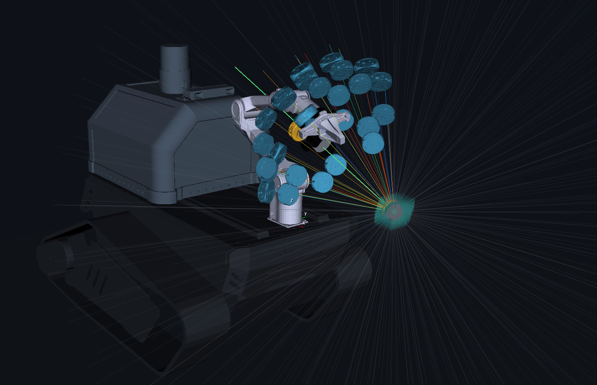
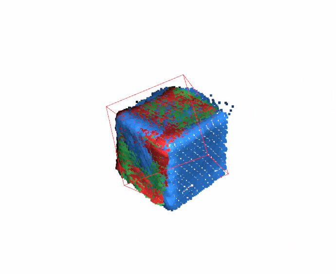

<div align="center">

# PiPER Active RGB-D Scanning

**A safety-gated ROS 2 system for open-label target perception, next-best-view planning, autonomous arm motion, and multi-view 3D reconstruction on a tracked mobile manipulator.**

<a href="docs/assets/readme/media/ray-process.mp4">
  
</a>

<sub>Target-centred viewpoints and candidate rays around the robot. Click the image to open the full ray-planning video.</sub>


[Architecture](ARCHITECTURE.md) · [System diagrams](docs/architecture/system-diagrams.md) · [Clean installation](CLEAN_INSTALL.md) · [Operator commands](OPERATOR_COMMANDS.md) · [Mechanical CAD](CAD/)

</div>

## Core capabilities

<table>
  <tr>
    <td width="33%" valign="top">
      <h3>Acquire → Track → Understand</h3>
      <p>Ground a runtime target label with GroundingDINO, maintain its mask with SAM2, project confidence-qualified L515 depth, and publish target, obstacle and occlusion evidence in the robot frame.</p>
    </td>
    <td width="33%" valign="top">
      <h3>Measure → Plan → Qualify</h3>
      <p>Build coverage only from accepted RGB-D observations, rank target-centred next-best views, filter reachability, and require exact Tesseract IK, collision and complete-path qualification.</p>
    </td>
    <td width="33%" valign="top">
      <h3>Move → Capture → Reconstruct</h3>
      <p>Execute through a sole safety-gated joint publisher, prove settled feedback, persist synchronized evidence, and produce target-only TSDF/GICP reconstruction outputs with provenance.</p>
    </td>
  </tr>
</table>

## System architecture

The production system is organised as a closed perception–planning–action loop. Every autonomous motion must pass through one command-authority chain, and only accepted measurements are allowed to update coverage or reconstruction.

<div align="center">
  
  <br>
  <sub>The tracked base supplies the mount, task request and pose snapshot. This repository does not command chassis motion.</sub>
</div>

## Demonstration gallery

<table>
  <tr>
    <td width="64%" align="center">
      <a href="docs/assets/readme/media/ray-process.mp4"></a>
    </td>
    <td width="36%" align="center">
      
    </td>
  </tr>
  <tr>
    <td align="center"><strong>Active viewpoint planning</strong><br><sub>Candidate camera poses and target-centred rays; click to open the MP4.</sub></td>
    <td align="center"><strong>RGB-D reconstruction</strong><br><sub>Registered multi-view surface evidence and reconstructed cube geometry.</sub></td>
  </tr>
</table>

## Target perception

The eye-in-hand Intel RealSense L515 provides RGB, aligned depth, confidence, calibration and timing. GroundingDINO performs open-label acquisition; SAM2 maintains a dense target mask; calibrated depth and TF then produce robot-frame target and scene evidence.

<div align="center">
  
</div>

Heavy AI workers use an isolated Python 3.10-or-newer environment and do not share the ROS 2 Foxy Python environment or any motion-command authority.

## Active viewpoint and motion planning

Planning begins with accepted observations, never predictions presented as measurements. The planner creates target-relative camera rays, ranks marginal surface information and novelty, removes obviously unreachable candidates, and sends the shortlist to an isolated Tesseract 0.35 worker for exact qualification.

<div align="center">
  
</div>

The detailed planner contracts, hashes and data ownership are maintained in [`docs/ai/`](docs/ai/) and summarised in [`ARCHITECTURE.md`](ARCHITECTURE.md).

## Guarded execution and recovery

Tesseract proposes motion; `scan_viewpoint_executor` independently authorizes it and remains the sole autonomous joint-command publisher. `piper_ctrl_single_node` retains enable/disable, SocketCAN, motor-watchdog, command-timing and feedback authority.

<div align="center">
  
</div>

Motion is opt-in and fail-closed. Stale identity, calibration, target, scene, motor or safety evidence prevents dispatch. Terminal handling returns through the configured home sequence, proves a settled hold, disables all six axes, and cleans up mission-owned processes.

## Multi-view capture and reconstruction

Each accepted viewpoint stores synchronized RGB, raw and confidence-qualified depth, the target mask, camera intrinsics, capture-time transform, joints, plan identity and quality metadata. Offline reconstruction consumes only admitted immutable observations.

<div align="center">
  
</div>

The reconstruction package provides target-only Open3D TSDF fusion, optional bounded target GICP registration, raw and cleaned meshes, coloured measured clouds, quality metrics and provenance reports.

## Hardware and software stack

<div align="center">
  
</div>

| Layer | Current components |
|---|---|
| Mobile platform | AgileX Bunker Pro 2 tracked base and enclosure; chassis motion is outside this repository's command boundary |
| Manipulator | AgileX PiPER 6-DOF arm with USB-CAN / SocketCAN interface |
| Active RGB-D sensing | Intel RealSense L515 in a qualified eye-in-hand holder |
| Optional mechanical provision | Enclosure-mounted ZED camera and LiDAR CAD; not consumed by the current scan runtime |
| Middleware | Ubuntu 20.04, ROS 2 Foxy, Python 3.8 for ROS nodes |
| Target perception | GroundingDINO, SAM2, calibrated RGB-D projection, tracking and occlusion analysis |
| View and motion planning | Measured voxel coverage, next-best-view ranking, capability filtering, Tesseract 0.35 |
| Execution | MissionEngine, safety evaluator, sole scan executor, PiPER SDK driver |
| Reconstruction | Open3D 0.19, target-only TSDF, optional bounded GICP and provenance reporting |

## Quick start

The supported host is Ubuntu 20.04 with ROS 2 Foxy already installed at `/opt/ros/foxy`.

```bash
git clone https://github.com/WenjunYU55/Piper_arm.git
cd Piper_arm

chmod +x scripts/setup/install_host_dependencies.sh
./scripts/setup/install_host_dependencies.sh

source /opt/ros/foxy/setup.bash
cd piper_ros_foxy
colcon build --symlink-install
cd ..
source source_piper_foxy_environment.sh
```

Verify the installation before connecting real hardware:

```bash
./verify_installation.sh
```

Start the mission listener:

```bash
./run_target_scan_mission.sh
```

The listener is command-free unless real motion is explicitly selected. Hardware operation requires the staged checks and commands in [`OPERATOR_COMMANDS.md`](OPERATOR_COMMANDS.md); do not infer motion authorization from this quick start.

## Repository map

```text
Piper_arm/
├── piper_ros_foxy/src/
│   ├── piper_msgs/                 ROS interfaces
│   ├── piper_description/          URDF and qualified runtime meshes
│   ├── piper/                      PiPER CAN / SDK driver
│   ├── piper_mobile_manipulation/  mission, perception, planning and execution
│   └── piper_tesseract_foxy/       Foxy bridge and isolated planning worker
├── L515_camera/                    RealSense build and hand-eye calibration
├── AI_perception_tests/            GroundingDINO / SAM2 workers and tests
├── motion_planning/tesseract/      rootless Tesseract runtime tooling
├── reconstruction/                 immutable-input 3D reconstruction
├── piper_gui/                      operator interface and ray review
├── integration/                    tracked-root robot-description contract
├── CAD/                            enclosure-v4 source and fabrication files
├── docs/                           architecture, contracts and historical evidence
├── tests/                           cross-package development tests
└── tools/                           diagnostics, replay and calibration utilities
```

## Mechanical design files

The [`CAD/enclosure-v4/`](CAD/enclosure-v4/) package contains the supplied SolidWorks assembly and parts, millimetre DXFs, printable STLs and seven-plate 3MF project. Its README describes what each component does and records fabrication and safety caveats; `MANIFEST.csv` provides a SHA-256 checksum for every file.

Design/manufacturing CAD is not a drop-in replacement for collision-qualified URDF/Tesseract geometry. Follow the repository's [`large-asset policy`](docs/architecture/asset_policy.md) and geometry qualification workflow before changing runtime meshes.

## Documentation

- [Architecture and responsibility boundaries](ARCHITECTURE.md)
- [Rendered system and subsystem diagrams](docs/architecture/system-diagrams.md)
- [Clean installation](CLEAN_INSTALL.md)
- [Operator commands and safety procedures](OPERATOR_COMMANDS.md)
- [Tracked-platform integration contract](integration/track_robot_description/README.md)
- [L515 camera and calibration](L515_camera/README.md)
- [AI-first contracts, flows and roadmap](docs/ai/00-index.yaml)
- [Mechanical CAD](CAD/README.md)

## Safety status

- Autonomous motion requires explicit launch opt-in, fresh mission authorization, valid perception and geometry, a collision-qualified plan, healthy all-six-axis feedback and a separately enabled arm.
- The gripper has no autonomous command path in the target-scan mission.
- A person/hand remains a terminal blocker; automatic contact manipulation is unqualified.
- The tracked base must remain stationary during arm dispatch. Base repositioning, brake authority and mounted-chassis acceptance are future integration work.
- ROS 2 Foxy is end-of-life. This repository keeps the qualified Ubuntu 20.04/Foxy baseline; porting to another distribution requires deliberate interface and hardware requalification.

This repository is research engineering software for a physically tested robot. Review the current qualification records and operator procedure before any hardware run.
