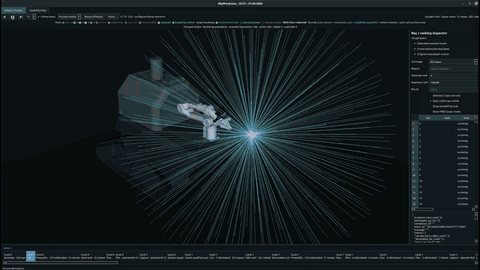
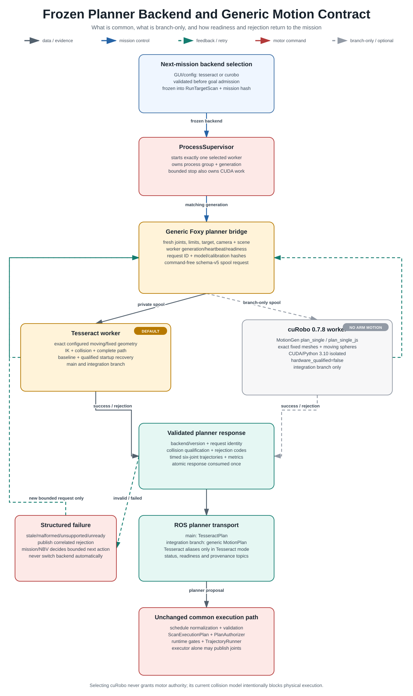

<div align="center">

# PiPER Active RGB-D Scanning

**A safety-gated ROS 2 system for open-label target perception, closed-loop next-best-view planning, autonomous arm motion, and multi-view 3D reconstruction on a tracked mobile manipulator.**

<a href="https://raw.githubusercontent.com/WenjunYU55/Piper_arm/main/docs/assets/readme/media/ray-process.mp4">
  
</a>

<sub>Inline accelerated preview · <a href="https://raw.githubusercontent.com/WenjunYU55/Piper_arm/main/docs/assets/readme/media/ray-process.mp4">play or download the full-quality H.264 MP4</a></sub>


[Architecture](ARCHITECTURE.md) · [Detailed system map](docs/architecture/system-diagrams.md) · [cuRobo integration](https://github.com/WenjunYU55/Piper_arm/tree/curobo-integration) · [Installation](CLEAN_INSTALL.md) · [Operator commands](OPERATOR_COMMANDS.md) · [CAD](CAD/)

</div>

## What the robot does

| 1. Perceive | 2. Choose and prove | 3. Move, measure and learn |
|---|---|---|
| Ground a runtime label with GroundingDINO, track its SAM2 mask, and project confidence-qualified L515 depth into `base_link`. | Rebuild coverage from accepted captures, rank target-centred views, and ask one frozen planner backend to prove a complete collision-qualified path. | Authorize through one command chain, settle on measured joint feedback, admit or reject the observation, and feed the result back into the next view. |

The tracked base carries the enclosure and arm but remains stationary and braked during PiPER motion. This repository exchanges task and base-home correlation data with the tracked-robot gateway; it does not publish chassis commands.

## Detailed system architecture

This is the complete feature map, from mission request to immutable reconstruction. Solid lines carry data or mission control; dashed green lines are runtime feedback, retry, reacquisition, and replanning. Gray dashed paths are explicitly branch-only or optional. Red is reserved for the sole motor-command path.

<div align="center">
  <a href="docs/assets/readme/architecture/system-overview.svg">
    
  </a>
  <br>
  <sub>Click to open the full-resolution SVG. Backend and command-authority status are labelled inside the diagram.</sub>
</div>

The diagram deliberately combines two audited repository states:

- **`main`:** Tesseract 0.35 is the active exact motion-planning path and transports `TesseractPlan`.
- **`curobo-integration`:** adds a frozen `tesseract | curobo` mission choice, a backend-neutral `MotionPlan` contract, and an isolated cuRobo 0.7.8 MotionGen worker. The current 167-sphere moving-link model is marked `hardware_qualified=false`, so cuRobo plans are blocked from physical execution. There is no automatic fallback or mid-mission backend switch.

See the [diagram audit and implementation evidence](docs/architecture/system-diagrams.md) for the exact commits and source paths used.

## Perception, tracking and reacquisition

The eye-in-hand L515 publishes synchronized RGB, native/aligned depth, confidence, intrinsics and timestamp health. GroundingDINO provides open-label acquisition, SAM2 propagates the mask, and ambiguity-aware depth produces a measured `Target3D`. A timestamped Kalman tracker may bridge a short outage as `LOW_CONFIDENCE`, but planning still requires a fresh measured lock.

<div align="center">
  <a href="docs/assets/readme/architecture/perception-pipeline.svg"></a>
</div>

The feedback is intentional: stale camera time, invalid depth, a lost target, or blocking occlusion prevents dispatch or capture and requests a correlated heavy refresh. Predicted geometry may guide planning, but it never becomes measured coverage or reconstruction input.

## Closed-loop next-best-view planning

Coverage is rebuilt only at the exact generation of an accepted schema-2 capture. The NBV policy ranks marginal information before travel, removes duplicate and hard-culled directions, then shortlists at most 12 voxel candidates or 6 ray directions for exact planning.

<div align="center">
  <a href="docs/assets/readme/architecture/viewpoint-planning-pipeline.svg"></a>
</div>

The three observation outcomes have different effects:

- **Accept:** atomically commit RGB-D evidence, advance the accepted-history generation, rebuild coverage, and request the next view.
- **Retry:** hold the achieved pose, run one correlated heavy perception refresh, and re-evaluate without inventing coverage.
- **Reject:** record the achieved FK, exclude or retire the failed view, and replan. A planner rejection can also retire a hard-infeasible ray.

The mission is bounded to 8–24 views, but completion is based on measured surface/feature convergence or safe-frontier exhaustion rather than an unconditional view count.

## Frozen planner backend and common motion contract

<div align="center">
  <a href="docs/assets/readme/architecture/planner-backend-pipeline.svg"></a>
</div>

On `curobo-integration`, the next-mission planner selection is validated before goal admission and frozen into the `RunTargetScan` goal and canonical mission hash. `ProcessSupervisor` starts exactly one planner worker. The generic bridge snapshots fresh joints, controller limits, target provenance, camera health, obstacles, robot/world hashes, and hand-eye calibration before writing a schema-v5 command-free request.

Both backends return a correlated, hashed, time-parameterized six-joint proposal to the unchanged common safety path. Tesseract uses exact configured robot meshes. The branch-only cuRobo worker uses MotionGen `plan_single` / `plan_single_js`, exact fixed Bunker meshes and an audited articulated-sphere approximation for moving links. Selecting cuRobo does not grant motor authority.

## Guarded execution and physical feedback

<div align="center">
  <a href="docs/assets/readme/architecture/execution-safety-pipeline.svg"></a>
</div>

Plans are normalized to a 20 Hz schedule and checked for finite six-joint samples, step size, speed-scaled MoveJ limits, identity hashes, TTL, backend, target drift, path validity and fresh dependencies. `scan_viewpoint_executor` is the sole autonomous `/joint_ctrl_single` publisher; `piper_ctrl_single_node` alone owns MoveJ, SocketCAN, enable/disable and all-six-motor feedback.

Runtime joint error, timeout, settle state, holder/floor clearance, camera health, tracking and scene evidence feed back on every stage. Transient evidence causes hold → refresh → re-authorize → resume of the exact stage. Cancellation or hard failure enters bounded terminal recovery. Loss of motor authority permits no further command and waits for disable proof.

## Capture admission and reconstruction

<div align="center">
  <a href="docs/assets/readme/architecture/capture-reconstruction-pipeline.svg"></a>
</div>

A settled capture uses the exact mask/RGB stamp plus 20 new native depth/confidence frames. Admission requires calibrated intrinsics and TF, confidence grade ≥ 8, at least 0.50 target support, fresh quality/occlusion evidence, achieved FK, and the matching plan provenance. Partial artifacts never count: the accepted schema-2 record and SHA-256 manifest are committed atomically.

After safe terminal/home-and-disable evidence—and tracked-base-home correlation where required—offline reconstruction validates immutable inputs and runs target-only TSDF fusion (3 mm voxels, 15 mm truncation by default), with optional bounded GICP and scene pose-graph refinement. Reconstruction failure is reported separately and does not rewrite the mission result.

## Hardware and compute boundaries

<div align="center">
  <a href="docs/assets/readme/architecture/hardware-topology.svg"></a>
</div>

| Layer | Current implementation |
|---|---|
| Mobile carrier | AgileX Bunker Pro 2 and enclosure; stationary during arm dispatch; chassis command remains outside this repository |
| Manipulator | AgileX PiPER 6-DOF arm over USB-CAN / SocketCAN |
| Active sensor | Qualified eye-in-hand Intel RealSense L515 |
| ROS runtime | Ubuntu 20.04, ROS 2 Foxy and Python 3.8 |
| Isolated AI | Python 3.10+ CUDA GroundingDINO/SAM2 workers over permission-bounded spools; no motor interface |
| Motion planning | Tesseract 0.35 on `main`; Tesseract or fail-closed cuRobo 0.7.8 on `curobo-integration` |
| Optional CAD provision | Enclosure-mounted ZED and LiDAR parts; not current runtime perception inputs |
| Reconstruction | Open3D 0.19, target-only TSDF, optional bounded GICP and provenance reporting |

## Quick start

The supported host is Ubuntu 20.04 with ROS 2 Foxy installed at `/opt/ros/foxy`.

```bash
git clone https://github.com/WenjunYU55/Piper_arm.git
cd Piper_arm

chmod +x scripts/setup/install_host_dependencies.sh
./scripts/setup/install_host_dependencies.sh

source /opt/ros/foxy/setup.bash
cd piper_ros_foxy
colcon build --symlink-install
cd ..
source source_piper_foxy_environment.sh
./verify_installation.sh
```

Start the command-free mission listener:

```bash
./run_target_scan_mission.sh
```

Real motion requires explicit opt-in and the staged checks in [OPERATOR_COMMANDS.md](OPERATOR_COMMANDS.md). Do not infer hardware authorization from this quick start.

## Repository map

```text
Piper_arm/
├── piper_ros_foxy/src/
│   ├── piper_msgs/                 ROS interfaces
│   ├── piper_description/          URDF and qualified runtime meshes
│   ├── piper/                      PiPER CAN / SDK driver
│   ├── piper_mobile_manipulation/  mission, perception, NBV and execution
│   └── piper_tesseract_foxy/       Foxy bridge and isolated planner workers
├── L515_camera/                    RealSense build and hand-eye calibration
├── AI_perception_tests/            GroundingDINO / SAM2 workers and tests
├── motion_planning/                isolated planner tooling
├── reconstruction/                 immutable-input 3D reconstruction
├── piper_gui/                      operator interface and ray review
├── integration/                    tracked-root robot-description contract
├── CAD/                            enclosure source and fabrication files
├── docs/                           architecture, contracts and evidence
├── tests/                          cross-package tests
└── tools/                          diagnostics, replay and calibration
```

The cuRobo adapter, worker and tests exist on [`curobo-integration`](https://github.com/WenjunYU55/Piper_arm/tree/curobo-integration), not on `main`.

## Mechanical design files

[`CAD/enclosure-v4/`](CAD/enclosure-v4/) contains the SolidWorks assembly and parts, millimetre DXFs, printable STLs and a seven-plate 3MF project. Its README describes each part and its robot function; `MANIFEST.csv` records a SHA-256 checksum for every file.

Manufacturing CAD is not a substitute for collision-qualified URDF/planner geometry. Follow the [large-asset policy](docs/architecture/asset_policy.md) and geometry-qualification workflow before changing runtime meshes.

## Documentation

- [Architecture and responsibility boundaries](ARCHITECTURE.md)
- [Detailed system and feedback diagrams](docs/architecture/system-diagrams.md)
- [Planner backend design on `curobo-integration`](https://github.com/WenjunYU55/Piper_arm/blob/curobo-integration/docs/architecture/motion_planner_backends.md)
- [Clean installation](CLEAN_INSTALL.md)
- [Operator commands and safety procedures](OPERATOR_COMMANDS.md)
- [Tracked-platform integration contract](integration/track_robot_description/README.md)
- [L515 camera and calibration](L515_camera/README.md)
- [AI-first contracts and flows](docs/ai/00-index.yaml)
- [Mechanical CAD](CAD/README.md)

## Safety status

- Autonomous motion requires explicit launch opt-in, fresh mission authorization, valid perception and geometry, a collision-qualified plan, healthy all-six-axis feedback and a separately enabled arm.
- The current cuRobo moving-link collision model is not hardware-qualified; the integration branch therefore blocks physical cuRobo execution.
- The gripper has no autonomous command path in the target-scan mission.
- A person or hand remains a terminal blocker; automatic contact manipulation is unqualified.
- The tracked base must remain stationary during arm dispatch. Base repositioning and brake authority remain external integration responsibilities.
- ROS 2 Foxy is end-of-life. Porting the qualified Ubuntu 20.04/Foxy baseline requires deliberate interface and hardware requalification.

This is research engineering software for a physical robot. Review the current qualification evidence and operator procedure before any hardware run.
