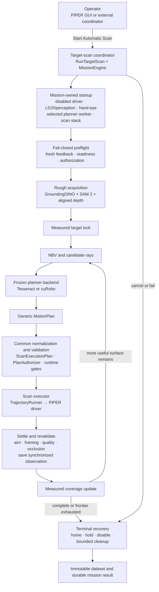

# PiPER Active-View 3D Scanning

<p align="center">
  Autonomous eye-in-hand object scanning with ROS 2, Intel RealSense L515,
  GroundingDINO, SAM 2, next-best-view planning, and fail-closed robot execution.
</p>

<p align="center">
  
  
  
  
</p>

This repository combines a PiPER six-axis arm, an eye-in-hand L515 RGB-D
camera, semantic segmentation, target-centred next-best-view (NBV) selection,
collision-aware planning, supervised trajectory execution, dataset capture,
and offline reconstruction in one mission pipeline.

> [!CAUTION]
> This is a robotics research prototype. Real-arm motion is disabled by
> default. Planner selection alone never grants motion authority, and software
> cancel is not a physical emergency stop. Begin with the proposal-only path
> and follow the [operator procedure](OPERATOR_COMMANDS.md) before enabling any
> hardware motion.

## What the system does

| Stage | Responsibility |
|---|---|
| Acquire | Move to a bounded target-facing observation from a rough target position. |
| Understand | Combine GroundingDINO, SAM 2, aligned depth, and hand-eye transforms into a measured target lock. |
| Select | Track measured coverage and rank target-centric NBV candidates. |
| Plan | Use one frozen planner backend—Tesseract or cuRobo—to produce a generic, collision-qualified `MotionPlan`. |
| Execute | Apply common normalization, authorization, freshness, drift, following-error, timeout, and motor-health gates. |
| Capture | Save synchronized RGB-D, mask, joints, camera pose, and planner provenance at accepted settled views. |
| Reconstruct | Build and inspect target-only point clouds and meshes offline without changing the completed robot mission result. |

## How it works



The mission and NBV logic do not depend on the selected planner. Tesseract and
cuRobo are isolated workers; neither can publish PiPER commands. Every accepted
plan enters the same authorization and execution-safety path. See the
[system architecture](docs/architecture/system-overview.md) for process and
environment boundaries.

## Start here

### 1. Install and verify

The reference installation is Ubuntu 20.04 with ROS 2 Foxy. Follow the
[clean installation](CLEAN_INSTALL.md), then run:

```bash
cd ~/Piper_arm
./verify_installation.sh
./AI_perception_tests/groundingdino_test/check_env.sh
```

The first command validates software and overlays; it does not prove physical
arm, CAN, camera, firmware, cable, or workspace safety.

### 2. Run a proposal-only startup

Use two terminals:

```bash
# Terminal 1: coordinator; no real-motion opt-in
cd ~/Piper_arm
./run_target_scan_mission.sh
```

```bash
# Terminal 2: GUI
cd ~/Piper_arm
./start_gui.sh
```

This is the correct first smoke test on a new installation. It does not grant
the coordinator permission to enable or move the arm.

### 3. Operate the complete system

Before any supervised physical run, use the
[operator quick start](OPERATOR_COMMANDS.md). It defines:

- CAN and all-six-joint preflight checks;
- coordinator, GUI, and RViz startup order;
- next-mission planner and scan-policy selection;
- the current real-motion qualification boundary;
- cancellation, homing, disable, and emergency procedures;
- dataset locations and shutdown proof.

Do not infer a safe physical command from examples elsewhere in the repository.
The operator guide is the authority.

## Planner backends

| Backend | Purpose | Current status |
|---|---|---|
| Tesseract | Exact configured mesh/convex collision model and established planning path. | Regression baseline and current supervised-planning reference. Physical use still depends on the active model and all mission gates. |
| cuRobo 0.7.8 | CUDA MotionGen backend behind the same generic planner contract. | Installed and command-free GPU planning is verified. The current Bunker approximation is **not hardware-qualified**, so physical cuRobo motion remains blocked. |

The GUI selection applies to the **next** mission and becomes immutable when
that mission starts. There is no automatic fallback or mid-mission backend
switch. See [motion-planner backends](docs/architecture/motion_planner_backends.md).

## Validated environment

The current reference workstation was checked on **28 August 2026**:

| Component | Verified reference |
|---|---|
| Host | Ubuntu 20.04, Linux 5.15, Intel Core i9-10900X (10 cores / 20 threads), 125 GiB RAM |
| GPU | NVIDIA GeForce RTX 3090, 24 GiB, driver 570.133.07, compute capability 8.6 |
| ROS | ROS 2 Foxy, system Python 3.8.10 |
| Perception | Python 3.10.20, PyTorch 2.11.0+cu128, CUDA 12.8, cuDNN 9.19 |
| Planning | Tesseract 0.35 isolated worker; cuRobo 0.7.8 in a separate Python 3.10 environment |
| Camera | Intel RealSense L515; librealsense 2.50.0 and realsense-ros 4.0.4 |
| Arm interface | `piper-sdk==0.6.1`, `python-can==4.5.0`, SocketCAN at 1 Mbps |

The full evidence and validation commands are in
[validated environments](docs/reference/validated-environments.md). Jetson is
a planned deployment target, not a currently proven installation; its JetPack,
CUDA, architecture, ROS, model, and latency results will be recorded there only
after an end-to-end validation.

## Repository map

```text
Piper_arm/
├── piper_ros_foxy/        ROS packages: mission, planning adapters, safety, execution, driver
├── piper_gui/             Native GUI views, clients, configuration, and scan controls
├── L515_camera/           Pinned RealSense build, calibration, diagnostics, and launch tools
├── AI_perception_tests/   Isolated GroundingDINO/SAM 2 environment and perception tests
├── motion_planning/       ROS-free Tesseract and cuRobo workers and qualification tools
├── reconstruction/       Offline point-cloud and TSDF reconstruction
├── integration/          Tracked-robot frame and gateway integration contracts
├── tests/                 Cross-package regression and adapter tests
├── tools/                 Development, diagnostics, and asset-generation utilities
└── docs/                  Architecture, operation, environment, research, and AI routing docs
```

Root-level shell scripts are intentionally retained as stable operator entry
points. Implementation code and generated artifacts belong in the subsystem
directories above; datasets, build trees, environments, downloaded weights,
and runtime outputs are ignored.

## Documentation

| Need | Document |
|---|---|
| Install on a clean workstation | [Clean installation](CLEAN_INSTALL.md) |
| Run, cancel, recover, and shut down | [Operator quick start](OPERATOR_COMMANDS.md) |
| Understand the complete system | [System architecture](docs/architecture/system-overview.md) |
| Understand package ownership | [Architecture reference](ARCHITECTURE.md) |
| Configure Tesseract or cuRobo | [Motion-planner backends](docs/architecture/motion_planner_backends.md) |
| Check proven hardware/software versions | [Validated environments](docs/reference/validated-environments.md) |
| Navigate all project documentation | [Documentation index](docs/README.md) |
| Review dated handoff evidence | [Historical system handoff](docs/historical/system_handoff_2026_08_11.md) |

Machine-oriented architecture and maintenance routing live under `docs/ai/`.
They are kept in sync with the code and should be read before structural work.

## Development and tests

Source the canonical overlay before running ROS-aware tests:

```bash
cd ~/Piper_arm
source ./source_piper_foxy_environment.sh
python3 -m pytest -q tests
```

Package-specific and GPU commands are documented in the
[documentation index](docs/README.md). Ordinary ROS/Foxy tests do not import
cuRobo; GPU integration tests are opt-in and never command the physical robot.

## Project status

- ROS 2 Foxy is end-of-life; the validated workstation remains pinned to its
  compatible Ubuntu 20.04 environment.
- Real motion remains opt-in and fail-closed. Higher speeds, new collision
  models, new mounts, and new deployment platforms require explicit
  requalification.
- cuRobo is architecturally integrated but its current mobile-platform
  collision approximation is not physically qualified.
- Jetson deployment is planned and deliberately marked unverified until the
  clean install and complete command-free/hardware test matrix pass.

## Acknowledgements

This research stack builds on ROS 2, Intel RealSense, GroundingDINO, SAM 2,
Tesseract Robotics, cuRobo, Open3D, and the PiPER SDK. Their upstream licenses
and model terms continue to apply to the corresponding dependencies and
downloaded assets.
