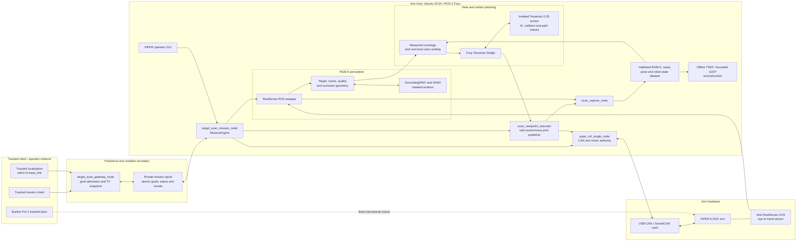
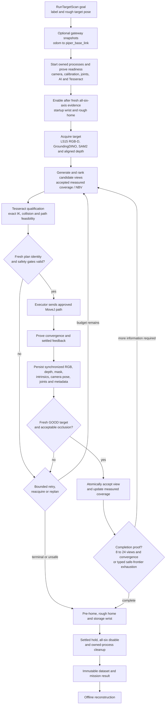
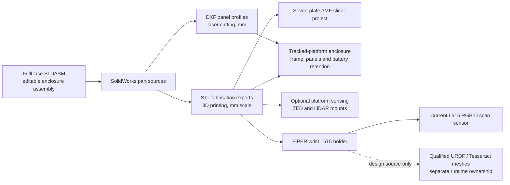

# System diagrams

These diagrams are rendered directly by GitHub from Mermaid source. They
describe the current repository interfaces and intentionally distinguish
implemented command paths from mechanical or future integration boundaries.

## Hardware and software architecture

The dashed base-to-arm link is deliberate: the tracked chassis provides the
mounting frame, task request and pose transform, but this repository does not
command the base. Mounted-chassis collision TF and brake authority remain
deferred integration work.

## Autonomous target-scan flow

Tesseract proposes collision-qualified motion; the executor remains the sole
autonomous joint-command publisher, and the PiPER driver owns enable/disable,
CAN timing, motor health and feedback. GroundingDINO/SAM2 perception does not
have a command path to the gripper.

## CAD-to-robot relationship

The CAD snapshot supports manufacture and design review. Runtime meshes remain
at their established URDF/Tesseract paths and may only be regenerated through
the repository's hash-checked geometry and qualification workflow.

## Evidence sources

- [`README.md`](../../README.md)
- [`ARCHITECTURE.md`](../../ARCHITECTURE.md)
- [`docs/ai/10-system-map.yaml`](../ai/10-system-map.yaml)
- [`docs/ai/40-flows.yaml`](../ai/40-flows.yaml)
- [`integration/track_robot_description/README.md`](../../integration/track_robot_description/README.md)
- [`CAD/enclosure-v4/README.md`](../../CAD/enclosure-v4/README.md)
