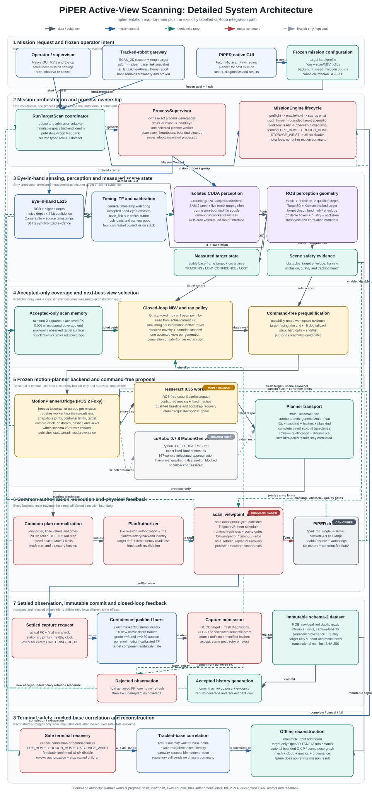
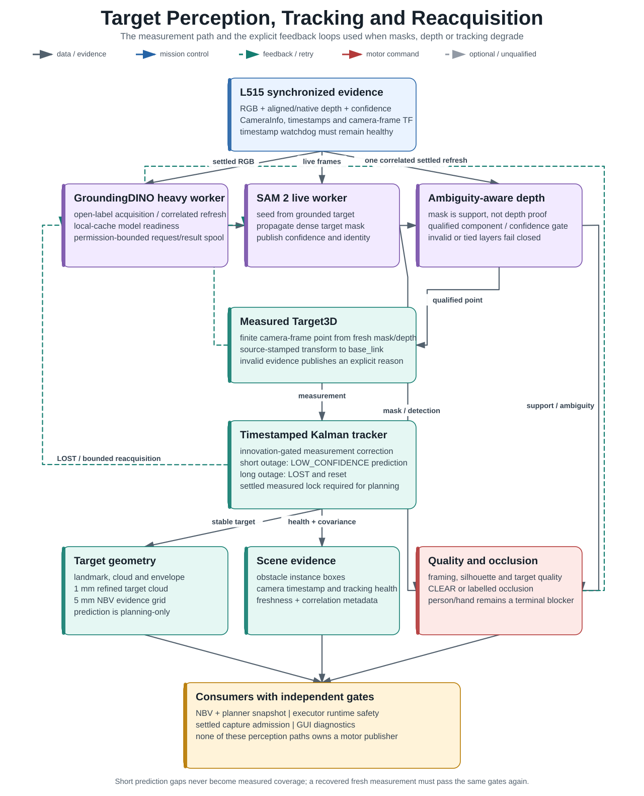
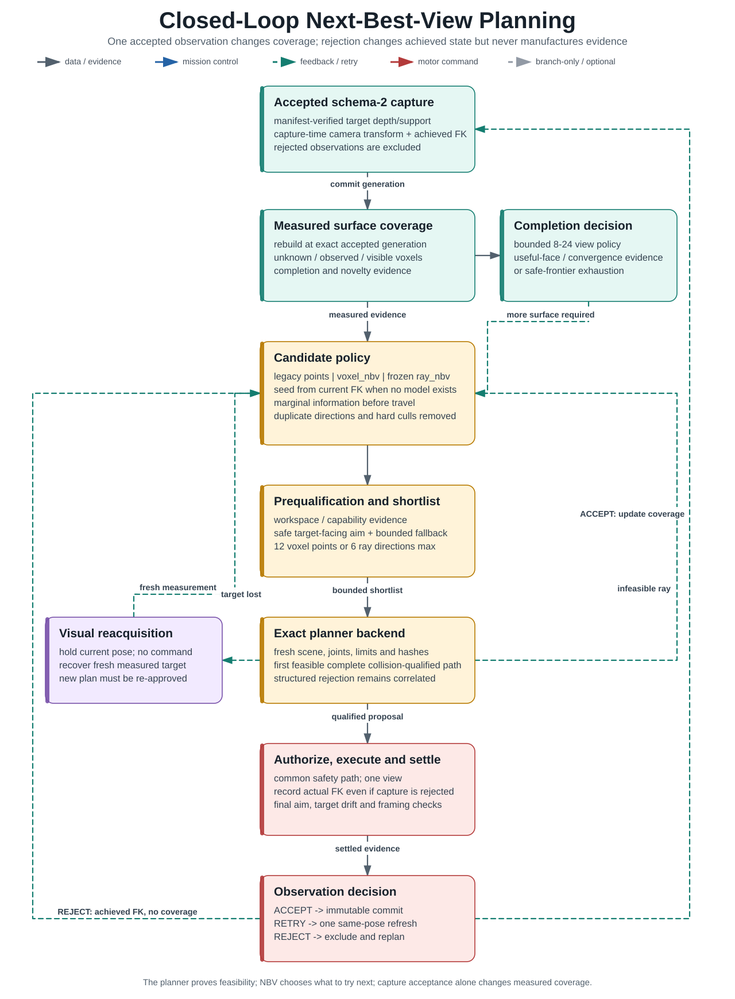
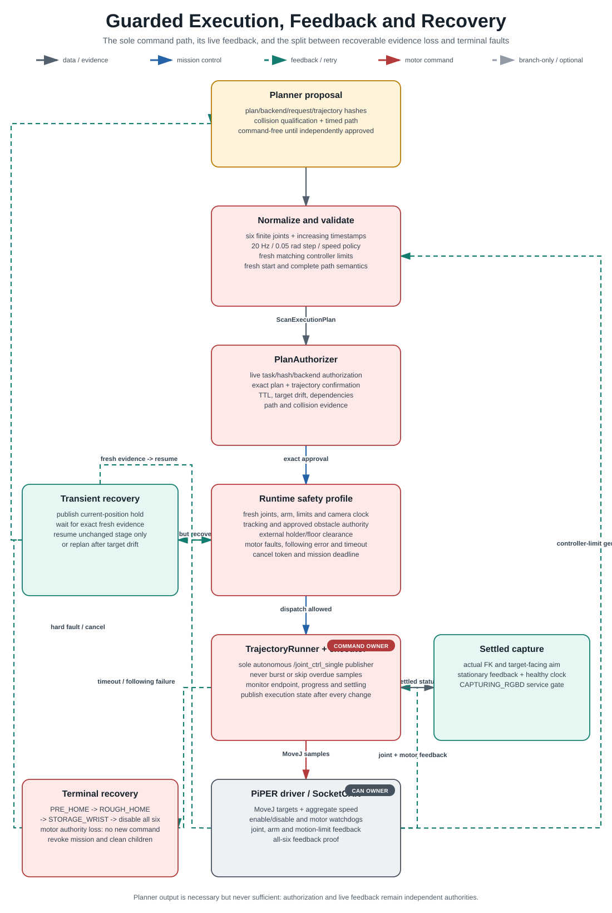
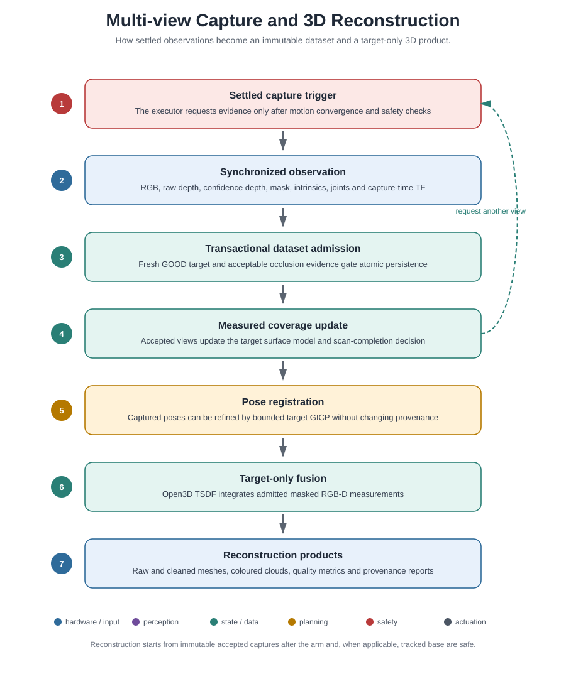
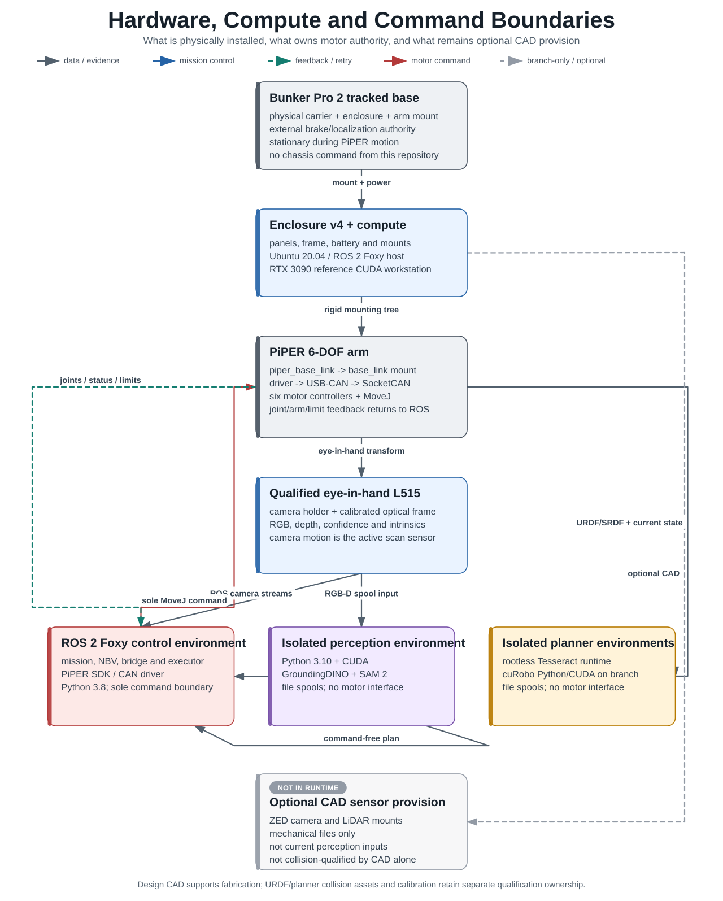

# System and subsystem diagrams

These figures provide a readable overview of the production stack while keeping
the command, measurement and integration boundaries explicit. Generated SVGs
are committed so GitHub renders them without an external diagram service.

## Visual vocabulary

| Colour | Meaning |
|---|---|
| Blue | Physical sensors and inputs |
| Violet | Perception and learned models |
| Teal | State, accepted evidence and data products |
| Amber | View and motion planning |
| Red | Safety, authorization and recovery |
| Graphite | Physical actuation and compute infrastructure |
| Gray | Optional or non-integrated hardware |

Solid arrows show the main runtime progression. Dashed return arrows show
feedback, replanning or recovery. A dashed or gray hardware stage is not an
implemented data or command path.

## Whole-system architecture

<div align="center">
  
</div>

The tracked base supplies the physical mount, mission request and pose snapshot.
This repository does not publish chassis commands; mounted-base collision TF,
brake authority and repositioning remain integration work.

## Target perception and geometric state

<div align="center">
  
</div>

The current production sensing path is the eye-in-hand L515. ZED and LiDAR
parts in the enclosure CAD are optional mechanical provision and are not shown
as perception inputs.

## Active viewpoint and motion planning

<div align="center">
  
</div>

Accepted measurements may update coverage. Predicted target geometry may guide
view selection but must not be presented to reconstruction as measured evidence.

## Guarded motion execution and recovery

<div align="center">
  
</div>

Tesseract owns exact geometric feasibility, the executor owns autonomous plan
authorization and joint publication, and the PiPER driver owns CAN, motors and
feedback. None of these authorities is duplicated by the GUI or AI workers.

## Multi-view capture and reconstruction

<div align="center">
  
</div>

Reconstruction consumes immutable accepted captures after the mission has
entered a safe terminal state and, where applicable, the tracked-base home
report has been correlated.

## Hardware topology

<div align="center">
  
</div>

Design CAD under [`CAD/`](../../CAD/) supports manufacturing and design review.
The collision-qualified meshes used by the URDF and Tesseract keep their
established runtime ownership and paths.

## Sources and regeneration

The diagrams are generated using only the Python standard library:

```bash
python3 docs/architecture/diagrams/generate_diagrams.py
```

See [`docs/architecture/diagrams/README.md`](diagrams/README.md) for the visual
and maintenance rules.

## Architecture evidence

- [`README.md`](../../README.md)
- [`ARCHITECTURE.md`](../../ARCHITECTURE.md)
- [`docs/ai/10-system-map.yaml`](../ai/10-system-map.yaml)
- [`docs/ai/40-flows.yaml`](../ai/40-flows.yaml)
- [`integration/track_robot_description/README.md`](../../integration/track_robot_description/README.md)
- [`CAD/enclosure-v4/README.md`](../../CAD/enclosure-v4/README.md)
