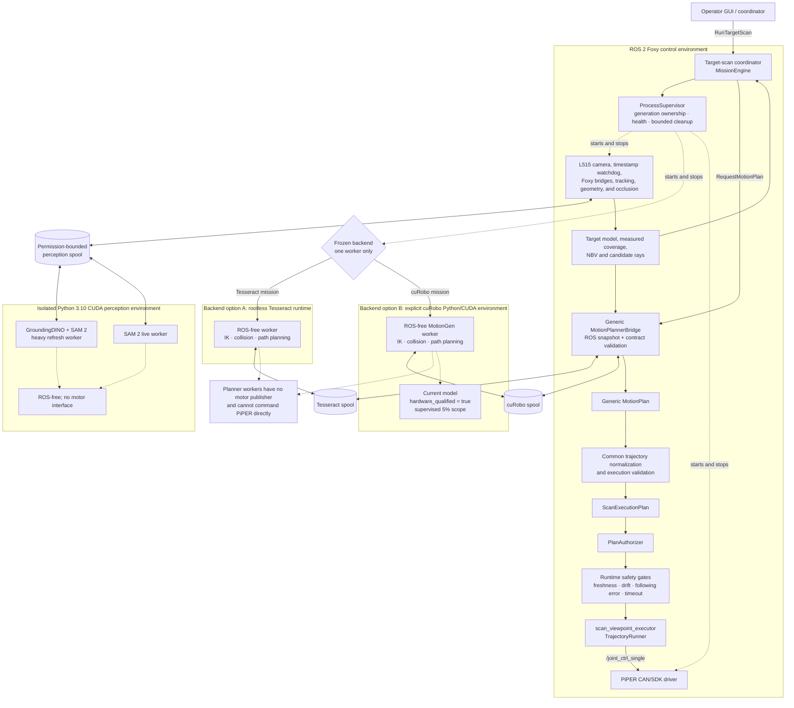
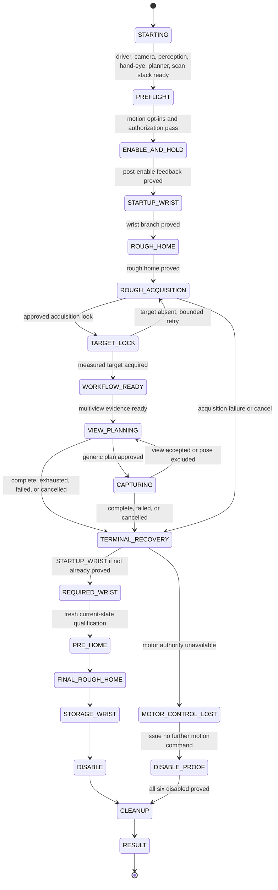

# System overview

This document explains the runtime boundaries of the PiPER active-view scanning
system. For package-level ownership and dependency rules, see
[`ARCHITECTURE.md`](../../ARCHITECTURE.md). For operator commands, use
[`OPERATOR_COMMANDS.md`](../../OPERATOR_COMMANDS.md).

## Design rule

ROS, GUI, and CLI components adapt external inputs into application requests.
Mission orchestration owns progression. Perception and NBV decide what target
view should be attempted next. A selected planner decides whether the robot can
reach that view. The common authorization and execution path decides whether a
plan may command the arm.

Planner workers are command-free. They cannot publish PiPER commands or bypass
the shared safety boundary.

## Runtime and process boundaries

`ProcessSupervisor` owns the top-level vision launcher. That launcher owns its
nested camera, timestamp watchdog, bridge, geometry, GroundingDINO, and SAM 2
process groups. The selected planner is the only planner worker started for a
mission generation.

## Mission lifecycle

Cancellation and controllable failures enter the same bounded terminal recovery
path. A motor-control-loss state issues no further motion command and requires
disable evidence. Software cancellation remains distinct from the physical
emergency-stop procedure.

## Responsibility boundaries

| Area | Owner | Must not own |
|---|---|---|
| Mission progression | `mission/engine.py` with the target-scan ROS adapter | Planner algorithms or PiPER command encoding |
| Perception and tracking | L515/semantic/tracking ROS adapters plus isolated GPU workers | Motion authorization |
| NBV and coverage | `piper_mobile_manipulation/planning/` | Planner backend selection or robot commands |
| Planner selection | Typed next-mission configuration frozen into the mission | Mid-mission fallback |
| Planner-native logic | Isolated Tesseract or cuRobo worker | ROS motor topics, CAN, or mission state |
| Plan authorization | `PlanAuthorizer` and common execution validation | Backend-native tensors or planner shortcuts |
| Automatic commands | `scan_viewpoint_executor` and `TrajectoryRunner` | Perception model inference or NBV scoring |
| Process lifetime | `ProcessSupervisor` and owned child launchers | Discovery/adoption of unrelated processes |

## Dataset boundary

Each accepted view persists synchronized RGB, aligned depth, mask, intrinsics,
joint state, camera pose, target/session correlation, planner provenance, and
selection diagnostics under `datasets/active_scan/`. Reconstruction consumes a
completed dataset asynchronously; reconstruction failure does not retroactively
change the robot mission's shutdown result.

## Where to extend the system

- Add a perception method behind the existing perception/target contract.
- Add an NBV strategy under `planning/` without importing a planner backend.
- Add a motion planner through the generic request/result and `MotionPlan`
  boundary, then reuse common normalization, authorization, and execution.
- Add reconstruction methods under `reconstruction/`; do not add robot-command
  dependencies there.
- Add operator controls through the GUI model/client boundary and persist only
  next-mission settings while a mission is idle.
